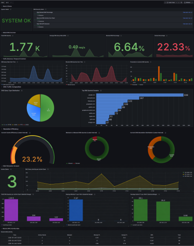

# IoT Network Monitoring System 📡

## Architecture 🏗️

The system is built around a Raspberry Pi that acts as the main monitoring node and integrates data collection, storage, visualization, alerting and natural-language interaction.

The architecture combines two main monitoring flows:

- **DNS monitoring** — Pi-hole manages DNS traffic and provides activity data. A Python collector processes metrics such as total queries, blocked requests, cached queries, active clients and most requested domains before storing them in InfluxDB.
- **System monitoring** — Telegraf collects CPU, memory, disk, network and system load metrics from the Raspberry Pi and the monitored PC, sending them directly to InfluxDB.

The collected data is stored in two time-series buckets:

- `pihole_metrics` — DNS activity and client metrics
- `system_metrics` — host and operating system metrics

From this storage layer, two main services consume the data:

- **Grafana** — provides dashboards for DNS activity and system health, and generates automated alerts when relevant thresholds are exceeded.
- **Telegram assistant** — allows monitoring data to be queried using natural language. A rule-based parser handles most requests, while a local LLM running through Ollama acts as a semantic fallback for less structured queries.

The system is deployed using Docker and Docker Compose, keeping the main services separated and making the environment easier to reproduce and maintain.

  

## Tech Stack 🛠️

`Python` `Docker` `Docker Compose` `Pi-hole` `Telegraf` `InfluxDB` `Grafana` `Telegram` `Ollama`

## Features ⚙️

- DNS traffic monitoring
- System metrics monitoring
- Time-series data storage
- Grafana dashboards
- Automated alerts
- Natural-language queries through Telegram
- Context-aware follow-up queries
- Local LLM fallback for less structured requests

## Conversational Assistant 🤖

The project includes a Telegram-based assistant that allows users to query monitoring data using natural language.

The assistant follows a hybrid interpretation approach:

1. A **rule-based parser** first tries to identify the user intent and extract parameters such as the host, time range, domain or query type.
2. If the query cannot be interpreted reliably, a **local LLM running through Ollama** is used as a semantic fallback.
3. The requested metrics are retrieved from **InfluxDB**.
4. The result is formatted into a readable response and returned through Telegram.

The assistant also keeps conversational context, allowing follow-up queries without repeating all the previous information.

## Demo 🎥

▶️ [Watch the full demo](https://youtu.be/rlF-sfBr4GE)
