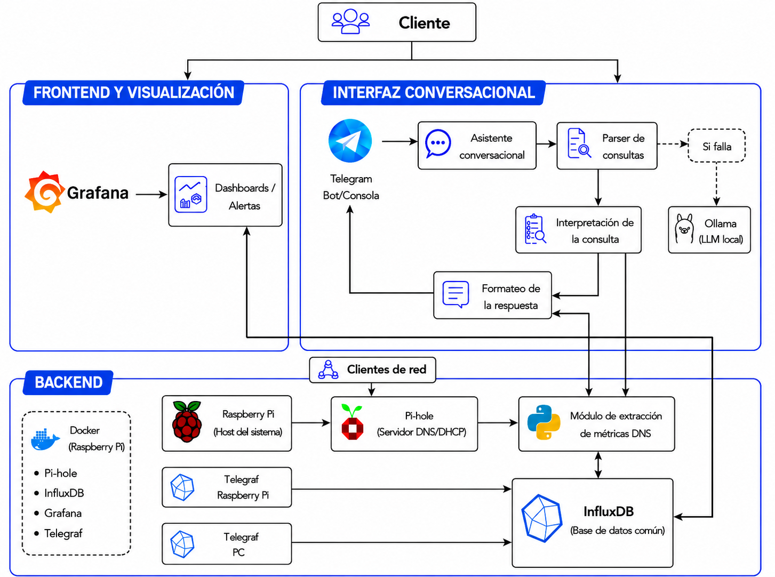

# IoT Network Monitoring System 📡

Docker-based monitoring system for DNS traffic and system metrics, developed as my Final Degree Project in Telecommunications Engineering.

## Overview 🔎

This project provides a modular monitoring environment built around a Raspberry Pi, combining DNS traffic analysis, system monitoring, time-series storage, visualization and natural-language interaction.

The system is organized around three main areas:

- **Monitoring backend** — collection and processing of DNS and system metrics
- **Visualization layer** — Grafana dashboards and automated alerts
- **Conversational interface** — Telegram assistant for querying monitoring data using natural language

## Architecture 🏗️

The system follows a modular architecture built around three main layers:

- **Monitoring backend** — Pi-hole collects DNS activity, a Python collector processes DNS metrics, and Telegraf gathers system metrics from the monitored hosts. All metrics are stored in InfluxDB as time-series data.
- **Visualization layer** — Grafana queries InfluxDB to provide dashboards for DNS activity and system health, while also generating alerts when relevant thresholds are exceeded.
- **Conversational interface** — A Telegram bot allows users to query monitoring data using natural language. A rule-based parser handles most queries, while a local LLM running through Ollama acts as a semantic fallback for less structured requests.

  

## Tech Stack 🛠️

`Python` `Docker` `Docker Compose` `Pi-hole` `Telegraf` `InfluxDB` `Grafana` `Telegram` `Ollama`

## Features ⚙️

- DNS traffic monitoring
- System metrics monitoring
- Time-series data storage
- Grafana dashboards
- Automated alerts
- Natural-language queries through Telegram
- Context-aware follow-up queries
- Local LLM fallback for less structured requests
